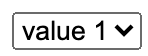
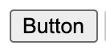

# Study of Accent Color for Form Controls

Mason Freed

July 10, 2020

 

As discussed on [CSSWG Issue 5187](https://github.com/w3c/csswg-drafts/issues/5187), and at the [July 1, 2020 CSSWG meeting](https://github.com/w3c/csswg-drafts/issues/5187#issuecomment-652700033), there is a desire to expand the stylability of form control elements, in particular by allowing the specification of the “accent color” for various elements. Two action items came out of the CSSWG discussion:

1. Study/enumerate the various places where accent-color might apply, across form elements, platforms, and browsers.
2. Propose spec text for the ‘accent-color’ property.

This document attempts to fulfill both action items.

# Foreground vs. Background

Before enumerating the form controls, an important point needs to be made about foreground vs. background. This was raised in the CSSWG meeting by [florian](https://github.com/w3c/csswg-drafts/issues/5187#issuecomment-652700033), and in the exploration below, it does seem like an important distinction. For several form control accent parts, there is a strong case to be made for two accent colors, one for the “background” and one for the “foreground” accent element. For example, a checkbox typically has a foreground “checkmark” glyph and a background color behind the glyph. If only one color (‘accent-color’) is specified, that color might have poor (or no) contrast against the foreground glyph color. Similarly, for the spin buttons on a number input, it might make sense to set the button background color **and** the up/down arrow glyph colors. In other controls, the “accent” element is more of a foreground element itself, and there is no corresponding background. For example, the popup activation widget for a &lt;select> control is typically painted on top of the background color of the text field. For these reasons, the proposal here is to specify two separate properties (subject to bikeshedding the names):

*   ‘accent-color-background’
*   ‘accent-color-foreground’

Given the above, we could also think about a shorthand ‘accent-color’ property that sets the accent-color-background to the specified color, and selects a complementary color (algorithm needed) for ‘accent-color-foreground’. This could also be reversed (set foreground, and auto-select background) but it seems to make the most sense this way. This shorthand property is not included in the proposed spec text in this document.

# Where Might Accent Color Apply?

This section is an exploration of the various controls that might utilize the ‘accent-color’ property. It is not exhaustive, and none of the listed controls and “accent” parts are required by the spec. These are up to each UA to decide. This list was compiled by examining the controls from [this test page](http://concrete-hardboard.glitch.me/) on Chrome (Windows, Mac, Android), Firefox (Windows and Mac), and Safari (Mac and iOS), and examining the various parts of each control. Some of the listed accent parts apply only to some browser/platform combinations, and those are listed in the Notes column.

Particular attention was paid to browsers on Safari, which has a system Accent Color setting. All browsers at least partially utilize this accent color to paint several form control “accent” elements. The elements that change color on Mac are all included in the list below, in addition to many elements that currently do **not** change color in response to Mac Accent Color. What follows is a list of all/common elements that seem (to me) like they **should** respect a ‘accent-color’ setting.

Again, it is important to note that the purpose of this exploration is simply to get a feel for the types of accent parts available, to see what might be controlled by the accent-color properties. These lists could change as browsers change their form control designs.

<table>
  <tr>
   <td><strong>Control</strong>
   </td>
   <td><strong>Example Screenshot</strong>
   </td>
   <td><strong>Foreground Accent Element</strong>
   </td>
   <td><strong>Background Accent Element</strong>
   </td>
   <td><strong>Differences across browsers and platforms</strong>
   </td>
  </tr>
  <tr>
   <td><code>&lt;input type=checkbox></code>
</td>
   <td>
   
   </td>
   <td>Checkmark glyph.
   </td>
   <td>Background behind glyph.
   </td>
   <td>Quite similar across browsers/platforms here.
   </td>
  </tr>
  <tr>
   <td><code>&lt;input type=radio></code>
</td>
   <td>
  
  </td>
   <td>Radio “dot” glyph.
   </td>
   <td>Background behind “dot”.
   </td>
   <td>Quite similar across browsers/platforms here.
   </td>
  </tr>
  <tr>
   <td><code>&lt;select></code>
</td>
   <td>

   </td>
   <td>Activation widget glyph. (e.g.
  
 in the screenshot)
   </td>
   <td>Activation widget background.
   </td>
   <td>The activation widget/button is sometimes a separate button (e.g. Firefox, Safari) and is sometimes just a glyph on top of the background color (e.g. Chrome). On Safari it appears to be a separate button until background color is set, at which point it behaves more like Chrome, except on iOS. Setting background color on Firefox causes the activation widgets to go away. 
   </td>
  </tr>
  <tr>
   <td><code>&lt;input type=text list=datalist></code>
</td>
   <td>
    
   </td>
   <td>Activation widget glyph. (e.g.

)
   </td>
   <td>Activation widget background.
   </td>
   <td>Similar to &lt;select>, except: Firefox does not show any activation widget here, and Safari’s button stays a separate button (and doesn’t change color) when background color is set, similar to &lt;select> on iOS. On Safari iOS, datalist renders similarly to Chrome &lt;select> with just a glyph and no separate button appearance.
   </td>
  </tr>
  <tr>
   <td><code>&lt;select multiple></code>
</td>
   <td>

   </td>
   <td>
   </td>
   <td>Background of selected rows.
   </td>
   <td>All browsers on Mac use the Mac “Highlight Color” system setting for the background of selected rows, which is typically related to, but different from, the “Accent Color” setting.
   </td>
  </tr>
  <tr>
   <td><code>&lt;button></code>
</td>
   <td>

   </td>
   <td>
   </td>
   <td>The color of the button in the active state.
   </td>
   <td>On Firefox Mac and Safari, the active state native button uses the system Accent Color setting. If the button is non-native (e.g. when it contains arbitrary HTML) this does not happen. Chrome does not use the Accent Color for button - all buttons are non-native. Other platforms, all browsers typically use grey.
   </td>
  </tr>
  <tr>
   <td><code>&lt;input type=range></code>
</td>
   <td>
  
   </td>
   <td>The range drag thumb.
   </td>
   <td>The shaded portion of the range slider track.
   </td>
   <td>The filled portion of the range slider track varies across browsers. E.g. Chrome has it only on the “left” of the thumb, while the rest have a background on both sides. Similarly, the thumb in some cases is a single solid color, while in others it has an outline and a filled portion.
   </td>
  </tr>
  <tr>
   <td><code>&lt;progress></code>
</td>
   <td>
  
   </td>
   <td>
   </td>
   <td>The shaded portion of the progress bar.
   </td>
   <td>Quite similar across browsers/platforms here.
   </td>
  </tr>
  <tr>
   <td><code>&lt;input type=search></code>
</td>
   <td>
   
   </td>
   <td>The color of the clear (‘X’) button.
   </td>
   <td>
   </td>
   <td>Fairly similar here. Firefox does not have a clear ‘X’ button.
   </td>
  </tr>
  <tr>
   <td><code>&lt;textarea></code>
</td>
   <td>
   
   </td>
   <td>The resize “handle”.
   </td>
   <td>
   </td>
   <td>Quite similar across browsers/platforms here.
   </td>
  </tr>
  <tr>
   <td><code>&lt;input type=color list=datalist></code>
</td>
   <td>
   
   </td>
   <td>The activation widget glyph for the color suggestion picker.
   </td>
   <td>
   </td>
   <td>Neither Firefox nor Safari support the color suggestion picker. On Chrome, the picker has a single activation glyph that sits above the background color, like &lt;select>.
   </td>
  </tr>
  <tr>
   <td><code>&lt;input type=date/week/…></code>
</td>
   <td>
   
   </td>
   <td>The activation widget and/or clear ‘X’ for the date/time picker.
   </td>
   <td>
   </td>
   <td>In Chrome, the activation widget sits above the background color, like &lt;select>. Safari Mac does not support pickers for any date/time controls, so there are no glyphs. Safari iOS renders these just like &lt;select>. Firefox only has a popup picker for type=date, and does not have any activation glyph - clicking any date part brings up the picker. Week, month, and datetime-local have no pickers or glyphs. And type=time does not have a picker, but once text is typed, a clear ‘X’ shows up. In all cases where glyphs are used, they sit above the background color.
   </td>
  </tr>
  <tr>
   <td><code>&lt;input type=number></code>
</td>
   <td>
   
   </td>
   <td>The “spin” button up/down glyphs.
   </td>
   <td>The background of the “spin” buttons.
   </td>
   <td>Quite similar across browsers/platforms here. All browsers have an “up” and “down” arrow which has a separate background color (typically light grey) and foreground “arrow” glyph (typically dark grey). When the input background color is changed, these buttons float above that background. On Mac, the button colors are not affected by the system Accent Color setting.
   </td>
  </tr>
  <tr>
   <td><code>&lt;input type=password></code>
</td>
   <td>
   
   </td>
   <td>The “reveal” or “save this password” glyph/widget.
   </td>
   <td>
   </td>
   <td>Most browsers do not have a built-in reveal button by default. Safari Mac shows a “password management” glyph, which sits over the input background color. Chrome has a default-off feature for a reveal button that similarly sits above the background color. No other browser/platform shows a widget.
   </td>
  </tr>
</table>

# Proposed Spec Text

**Name**: ‘accent-color-foreground’ and ‘accent-color-background’

**Value**: &lt;color>

**Initial**: UA-chosen value

**Applies to**: form control elements

**Inherited**: yes

**Percentages**: N/A

**Computed value**: computed color, see resolving color values

**Canonical order**: per grammar

**Animation type**: by computed value type

The ‘accent-color-background’ and ‘accent-color-foreground’ CSS properties set the color of “accent” parts/pieces of form control elements. The **text content** of form control elements are explicitly **not** included in the set of “accent” parts, as text content is already controlled by the [‘color’](https://drafts.csswg.org/css-color/#the-color-property) property. Not all form elements contain “accent” parts, and not all user agents use the same “accent” parts in the same way for the same form control. The ‘accent-color-background’ property sets the color of “background” accent elements, while the ‘accent-color-foreground’ property sets the color of “foreground” accent elements. A given control may have only background accents, only foreground accents, both, or neither.

Note: An “accent” part is, by definition, “A feature which gives a distinctive visual emphasis to something.” These accent parts will differ between implementations and potentially across platforms. Examples might include the background color of a checkbox, the activation button/widget for a select control, or the clear (‘X’) button on a search box.

Note: If the operating system provides an “Accent Color” user setting, the UA is encouraged to respect that setting in the initial value for ‘accent-color-background’. The UA may use a similar, though not identical, color in some cases, for example to enhance contrast or accessibility.
